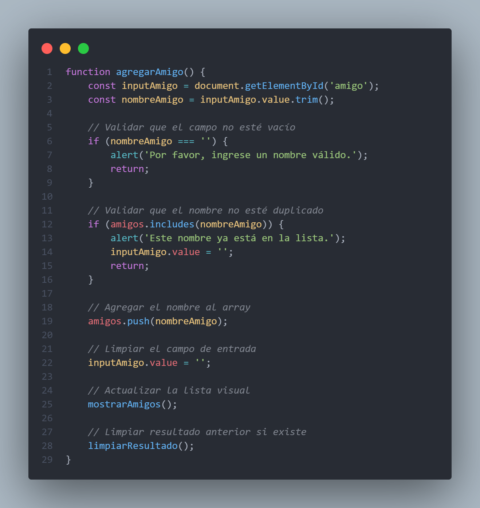
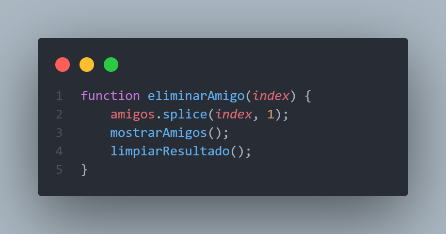
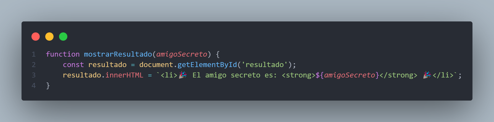

## 💻 Challenge de Programación - Amigo secreto

Este proyecto fue desarrollado como parte de un *Challenge* de programación propuesto por **Alura Latam**, utilizando **JavaScript**.  
El objetivo del reto fue poner en práctica habilidades fundamentales de lógica, manipulación del DOM y programación estructurada.

Participar en este challenge me permitió reforzar mis conocimientos y mejorar mis habilidades en desarrollo web.

# 🎁 Proyecto: Amigo Secreto

Este proyecto fue desarrollado como parte de un *Challenge* de programación de **Alura Latam**, utilizando **JavaScript**.  
El objetivo es crear una aplicación interactiva que permita registrar amigos, eliminarlos y realizar un sorteo aleatorio de "Amigo Secreto".

---

## 🚀 Funcionalidades

- ✅ Agregar nombres a una lista.
- ✅ Validación para evitar campos vacíos o nombres duplicados.
- ✅ Visualización dinámica de la lista de amigos.
- ✅ Eliminar nombres individualmente.
- ✅ Sortear un "Amigo Secreto" de manera aleatoria.
- ✅ Mostrar el resultado del sorteo en pantalla.
- ✅ Reiniciar la aplicación para empezar desde cero.
- ✅ Usabilidad mejorada: se puede presionar "Enter" para agregar nombres más rápido.

---

## 🧠 Tecnologías utilizadas

- HTML5
- CSS3
- JavaScript (vanilla)

---

## 📸 Capturas de pantalla

### 📥 Agregar amigos

### 🔁 Lista dinámica y eliminación

### 🎉 Resultado del sorteo

---

## 🎥 Demo en video (opcional)

Si deseas incluir un video mostrando el funcionamiento:

